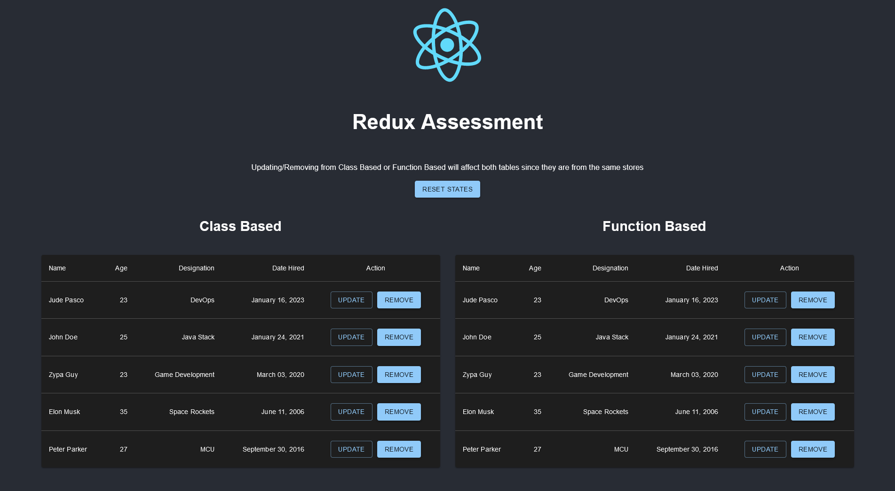
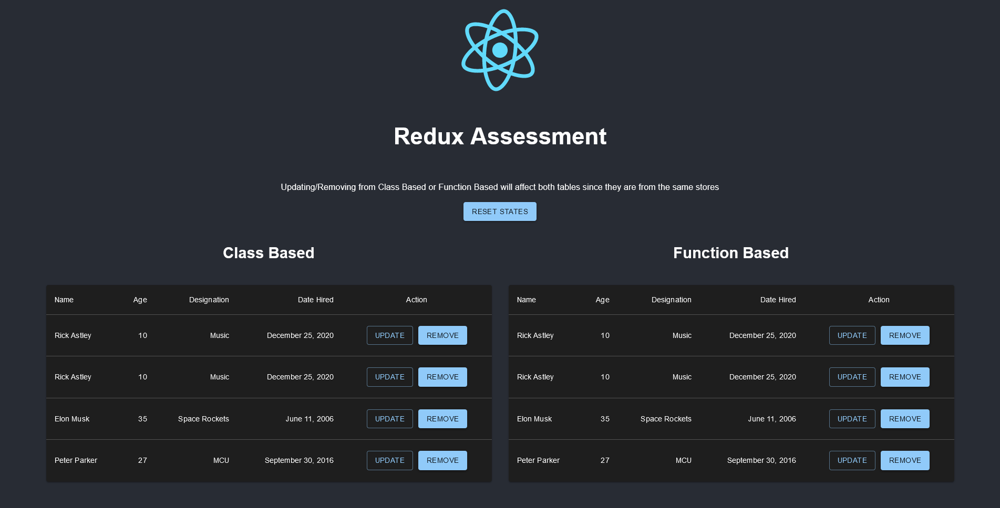

# React Assessment 5

## Description
React assessment 5 for redux.  

Two tables are shown in the program: Class-based and function-based components for the tables. Different ways of using Redux is shown in the code for the two tables.  

A user can either update or remove a record from the table. The update function sets the data in the row to a fixed record. Ideally, this will be done via a form to get the actual input of a user. But, for simplicity, a fixed data is done.

## Author
Jude Pasco  
Cohort #28

## Screenshots

### Initial Data

### Updated Data

